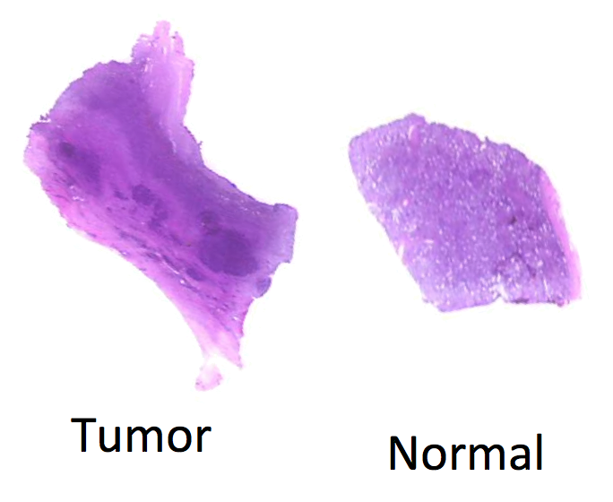
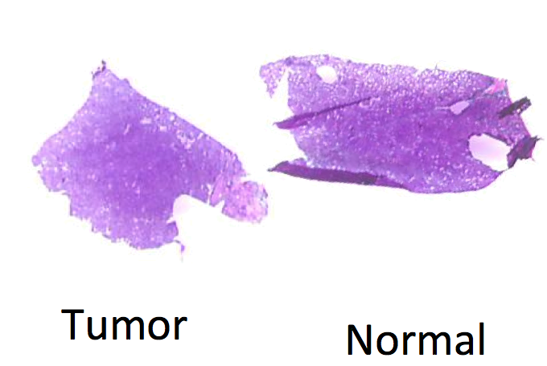
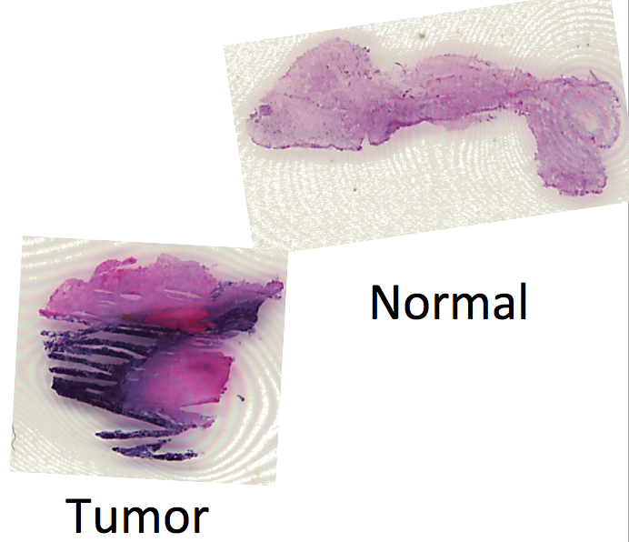
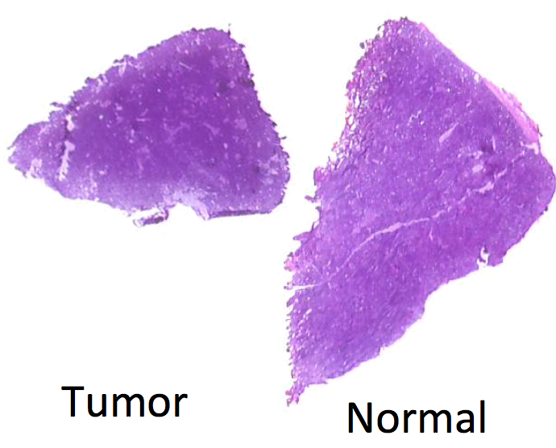
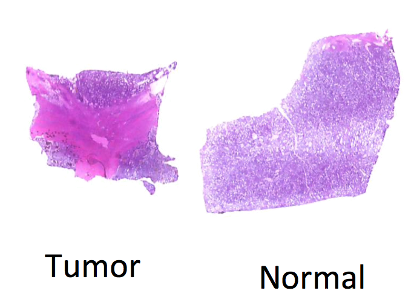
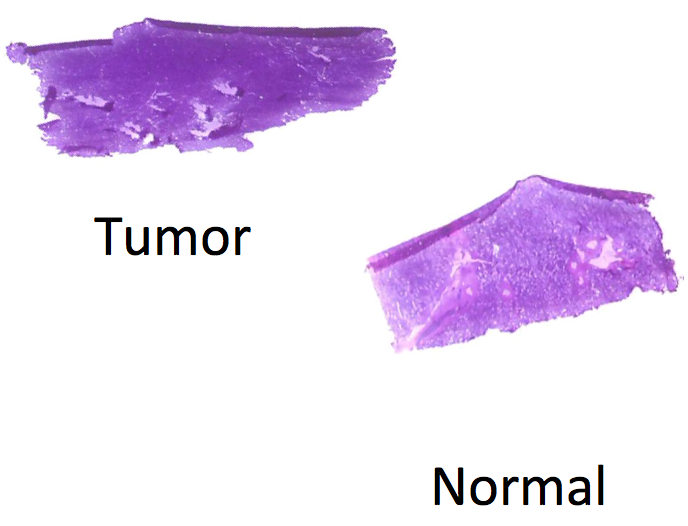
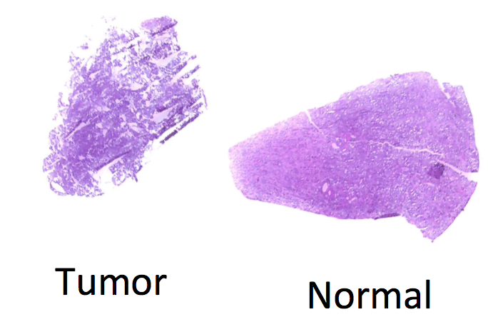

  
```{r style, echo=FALSE, results='asis'}
BiocStyle::markdown()
```

```{r setup, echo=FALSE, message=FALSE}
library(CardinalWorkflows)
register(SerialParam())
options(Cardinal.verbose=FALSE)
options(Cardinal.progress=FALSE)
RNGkind("L'Ecuyer-CMRG")
```

# Introduction 

For experiments in which analyzed samples come from different classes or conditions, a common goal of supervised analysis is classification: given a labeled training set for which classes are already known, we want to predict the class of a new sample.

Unlike unsupervised analysis such as segmentation, classification requires biological replicates for testing and validation, to avoid biased reporting of accuracy. *Cardinal* provides cross-validation for this purpose.

In this vignette, we present an example classification workflow using *Cardinal*.

We begin by loading the package:

```{r}
library(Cardinal)
```

# Classification of a renal cell carcinoma (RCC) cancer dataset

This example uses DESI spectra collected from a renal cell carcinoma (RCC) cancer dataset consisting of 8 matched pairs of human kidney tissue. Each tissue pair consists of a normal tissue sample and a cancerous tissue sample. The goal of the workflow is to develop classifiers for predicting whether a new tissue sample is normal or cancer.

MH0204_33 | UH0505_12 | UH0710_33 | UH9610_15
--------- | --------- | --------- | ---------
 |  |  | 

UH9812_03 | UH9905_18 | UH9911_05 | UH9912_01
--------- | --------- | --------- | ---------
 |  |  | 

In this RCC dataset, we expect that normal tissue and cancerous tissue will have unique chemical profiles, which we can use to classify new tissue based on the mass spectra.

First, we load the dataset from the *CardinalWorkflows* package. The data is stored in an older format, so we need to coerce it to an `MSImagingExperiment`.

```{r load-rcc}
data(rcc, package="CardinalWorkflows")
rcc <- as(rcc, "MSImagingExperiment")
```

The dataset contains 16,000 spectra with 10,200 *m/z*-values.

```{r show-rcc}
rcc
```

## Pre-processing

First, let's subset the dataset to include only the pixels where we have manually selected the tissue regions and labeled the diagnosis.

Then, we normalize the mass spectra to a common TIC.

```{r normalize-rcc}
rcc <- rcc %>%
  select(!is.na(diagnosis)) %>%
  normalize(method="tic") %>%
  process()
rcc
```

To process the dataset, we will first perform peak picking on the mean spectrum to create a set of reference peaks. We will then bin the peaks in the entire dataset to this reference.

```{r rcc-mean}
rcc_mean <- summarize(rcc, .stat="mean")
```

```{r rcc-peak-process}
rcc_ref <- rcc_mean %>%
  peakPick(SNR=3) %>%
  peakAlign(ref="mean",
            tolerance=0.5,
            units="mz") %>%
  peakFilter() %>%
  process()
```

Now we bin the rest of the dataset to the reference peaks.

```{r rcc-peak-bin}
rcc_peaks <- rcc %>%
  peakBin(ref=mz(rcc_ref),
          tolerance=0.5,
          units="mz") %>%
  process()

rcc_peaks
```

This produces a centroided dataset with 103 peaks.

Note that this centroided dataset will be useful for our exploratory analysis and for fitting the final classification model, but it cannot be used for cross-validation. This is because the mean spectrum was calculated from the whole dataset, so if we then used it for cross-validation, each CV fold would include some pre-processing steps that depended on the test set.

Pre-processing for cross-validation will require a different strategy.

## Visualization

Before proceeding with the statistical analysis, we'll first perform some and exploratory visual analysis of the dataset.

### Ion images

Let's plot the images for *m/z* 810, which appears abundant in both normal and tumor tissue, and doesn't seem to be very predictive.

```{r mz-810, fig.height=10}
image(rcc_peaks, mz=810, layout=c(4,2),
      contrast.enhance="suppress", normalize.image="linear")
```

As can be seen above, each matched pair of tissues belonging to the same subject are on the same slide (and therefore belong to the same run). Note also the the cancer tissue is on the left and the normal tissue is on the right on each slide.


### Prinipal components analysis (PCA)

Principal component analysis (PCA) is an unsupervised method for exploring a dataset. PCA is available in *Cardinal* through the `PCA()` method.

Below, we calculate the first 2 principal components. Note that PCA does not use any information about the diagnosis.

```{r rcc-pca}
rcc_pca <- PCA(rcc_peaks, ncomp=2)
```

We can overlay the PC scores of the first 2 principal components. It doesn't appear that either component distinguishes the diagnoses.

```{r pca-image, fig.height=10}
image(rcc_pca, layout=c(4,2), normalize.image="linear")
```

We can plot the scores of the first 2 components against each other to see how the separate the diagnoses (or don't, in this case).

```{r pca-scores}
pc_scores <- DataFrame(resultData(rcc_pca, 1, "scores"))
```

It doesn't appear that PCA separates cancer versus normal tissue. At least, not the first 2 components.

```{r pca-scoreplot-1}
plot(pc_scores, PC1 ~ PC2, groups=rcc$diagnosis)
```

PCA is also a useful way to visualize how much each run clusters together. A large amount of variation in the data tends to be variation between experimental runs. This is why it's useful to have matched pairs on the same slide.

```{r pca-scoreplot-2}
plot(pc_scores, PC1 ~ PC2, groups=run(rcc))
```


## Classification with spatial shrunken centroids (SSC)

To classify the dataset and automatically select peaks that distinguish each class, we will use the `spatialShrunkenCentroids()` method provided by *Cardinal*.

Important parameters to this method include:

- `method` The type of spatial weights to use:
    
    + *"gaussian"* weights use a simple Gaussian smoothing kernel
    
    + *"adaptive"* weights use an adaptive kernel that sometimes preserve edges better

- `r` The neighborhood smoothing radius; this should be selected based on the size and granularity of the spatial regions in your dataset

- `s` The shrinkage or sparsity parameter; the higher this number, the fewer peaks will be used to determine the classification.


### Cross-validation with SSC

In order to avoid over-fitting due to the pre-processing, each CV fold will be processed separately. For each CV fold, peak picking will be performed on the mean spectrum of the training set, and the test set will be binned to the peaks of the training set.

We use the `crossValidate()` method to perform cross-validation, and we treat each run as a separate fold.

```{r rcc-cv, message=FALSE}
rcc_ssc_cv <- crossValidate(rcc, rcc$diagnosis,
              .fun="spatialShrunkenCentroids",
              r=1, s=c(0,3,6,9,12,15),
              .fold=run(rcc), .process=TRUE,
              .processControl=list(SNR=3,
                                   tolerance=0.5,
                                   units="mz"))

summary(rcc_ssc_cv)
```

It appears s = 9 produces the best accuracy.

```{r rcc-cv-plot}
plot(summary(rcc_ssc_cv), Accuracy ~ s, type='b')
abline(v=9, lty=2, col="red")
```

Having selected the parameters, we can re-fit the model on the full dataset in order to interpret it.


```{r rcc-ssc}
rcc_ssc <- spatialShrunkenCentroids(rcc_peaks, rcc$diagnosis, r=1, s=9)

summary(rcc_ssc)
```

We should ignore the accuracy here though, as it is too optimistic.


### Plotting the classified images

Now we plot the classified images. Opacity is used to reflect the probability of class membership.

```{r rcc-ssc-image, fig.height=10}
image(rcc_ssc, layout=c(4,2))
```

### Plotting the (shrunken) mean spectra

Below, we plot the centroids for each class separately.

```{r rcc-ssc-mean}
setup.layout(c(2,1))
plot(rcc_ssc, column=1, col=discrete.colors(2)[1],
     lwd=2, layout=NULL)
plot(rcc_ssc, column=2, col=discrete.colors(2)[2],
     lwd=2, layout=NULL)
```

Although some differences are obvious, it is difficult to tell just from the mean spectra what peaks distinguish each diagnosis.

### Plotting and interpretting t-statistics of the *m/z* values

Plotting the t-statistics tells us exactly the relationship between each class's centroid and the global mean spectrum. The t-statistics are the difference between a class's centroid and the global mean, divided by a standard error.

Positive t-statistics indicate that peak is systematically higher in that class as compared to the global mean spectrum.

Negative t-statistics indicate that peak is systematically lower in that class as compared to the global mean spectrum.

Due to the shrinkage parameter `s`, unimportant peaks will have a t-statistic of 0 and will effectively have no effect on the classification.

```{r rcc-statistic}
plot(rcc_ssc, values="statistic", lwd=2)
```

This lets us clearly see which peaks are distinguishing cancer versus normal tissue.

### Retrieving the top *m/z*-values

We can use  the `topFeatures()` method to retrive the *m/z* values associated with each class.

Let's find the *m/z* values associated with cancer tissue.

```{r top-cancer}
topFeatures(rcc_ssc, class=="cancer")
```

```{r mz-885, fig.height=10}
image(rcc_peaks, mz=885, contrast.enhance="suppress", layout=c(4,2))
```

And let's find the *m/z* values associated with normal tissue.

```{r top-normal}
topFeatures(rcc_ssc, class=="normal")
```

```{r mz-215, fig.height=10}
image(rcc_peaks, mz=215, contrast.enhance="suppress", layout=c(4,2))
```


# Additional notes on cross-validation

Because we used a matched pairs experiment, with one subject per run, it was straightforward to treat the experimental runs as our CV folds. However, it does not always work out this way.

In general, a CV fold needs to include examples of both positive and negative classes. In addition, spectra from the same sample should not be split across multiple CV folds. In MS imaging, it is important to remember that the sample size *does NOT* equal the number of spectra or the number of pixels.


# Session information

```{r session-info}
sessionInfo()
```


